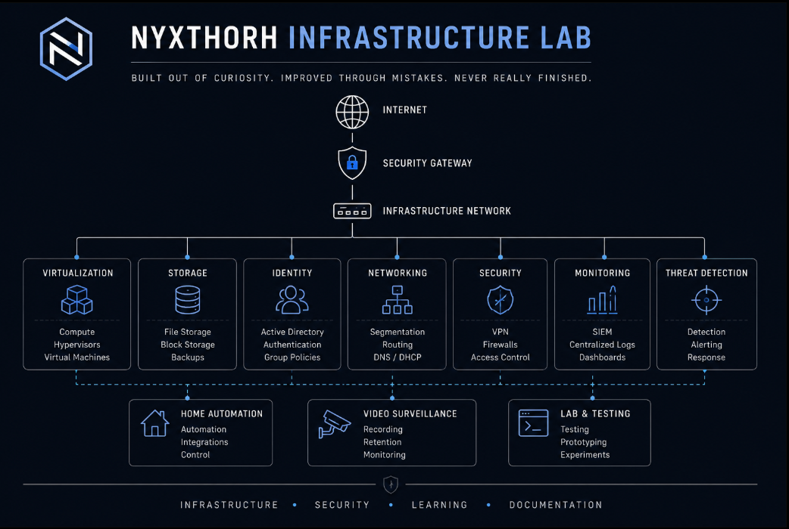

# Nyxthorh Lab

  

> **Personal infrastructure and cyber security homelab built for learning, experimentation, and documentation.**

---

## About

Welcome!

This repository documents my personal homelab, where I explore infrastructure, networking, systems administration, and cyber security through hands-on projects.

The lab has grown over several years as I've rebuilt services, experimented with new technologies, and documented what I've learned along the way. Some projects solve real problems, while others exist simply because I wanted to understand how something works.

The environment is constantly evolving, and that's exactly the point.

---

## Current Focus

The lab currently focuses on:

- Infrastructure
- Networking
- Virtualization
- Active Directory
- Linux & Windows Administration
- Security Monitoring
- Threat Detection
- Automation
- Home Automation
- Video Surveillance

---

## Repository

This repository contains documentation, architecture diagrams, project notes, and supporting material from the lab.

Documentation will be added continuously as the environment evolves.

---

## Security

Everything published here has been reviewed before becoming public.

Operational configurations, credentials, certificates, VPN configurations, firewall rules, scripts, API keys, IP addressing, and any other environment-specific information are intentionally excluded.

---

## Roadmap

- [x] Build the core infrastructure
- [x] Deploy centralized monitoring
- [x] Implement network segmentation
- [x] Create an Active Directory lab
- [ ] Publish architecture diagrams
- [ ] Expand detection engineering documentation
- [ ] Add project writeups
- [ ] Improve automation

---

## License

This project is licensed under the MIT License.

---

*Built out of curiosity. Improved through mistakes. Never really finished.*
